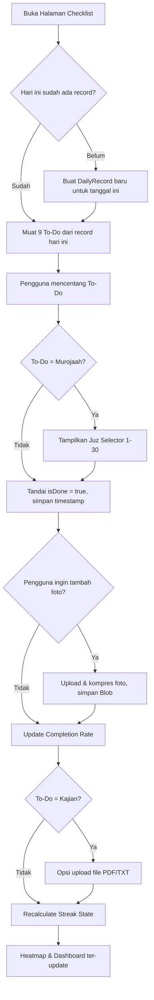
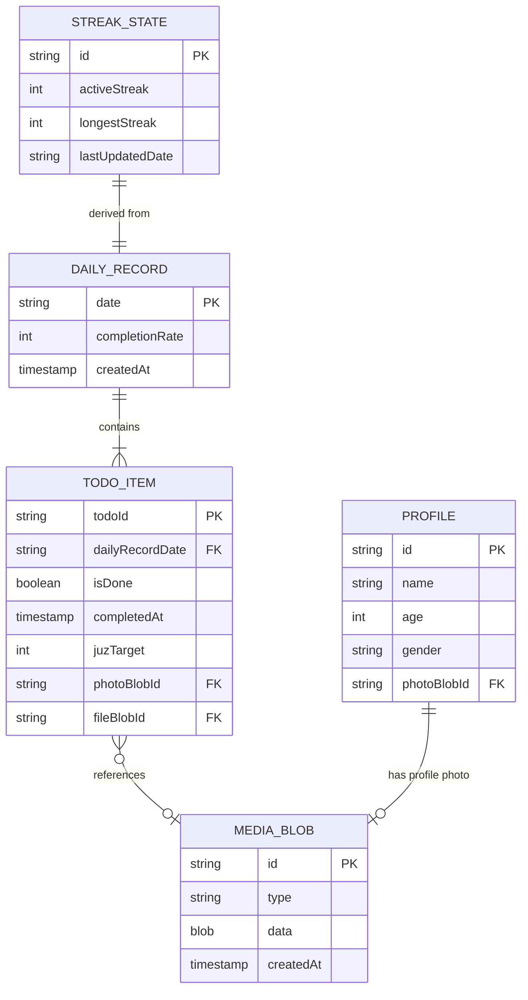
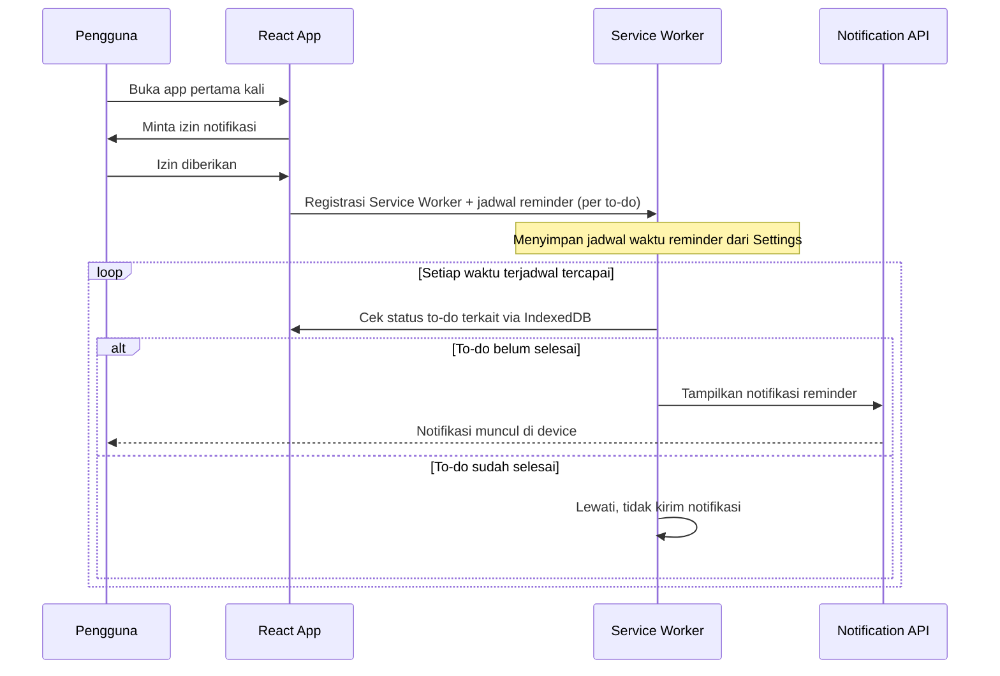

# Product Requirements Document — Ibadah Tracker

## 1. Document Control

| Field | Value |
|---|---|
| Product Name | Ibadah Tracker |
| PRD Title | Ibadah Tracker — Personal Worship Habit Dashboard (MVP) |
| Version | 1.0 |
| Status | Draft — Ready for Development (see Readiness Score, Section 12.9) |
| Author | Yassar Daffa |
| Contributors | — |
| Reviewers | — |
| Created Date | 2026-08-03 |
| Updated Date | 2026-08-03 |
| Target Release | MVP v1.0 |
| Version History | v1.0 — Initial PRD generated from stakeholder brief and validation round |

---

## 2. Product Context

### 2.1 Executive Summary
Ibadah Tracker adalah aplikasi web personal (Progressive Web App) untuk melacak konsistensi ibadah harian — sholat fardhu, sholat sunnah (tahajud, dhuha), tilawah/murojaah, dan kajian — melalui visualisasi contribution heatmap ala GitHub, checklist harian dengan bukti dokumentasi foto, dan sistem gamifikasi streak. Aplikasi berjalan 100% di sisi klien (local-first), tanpa akun/login, dengan data tersimpan di penyimpanan lokal browser (IndexedDB).

### 2.2 Product Background
Pengguna ingin membangun kebiasaan ibadah yang konsisten tetapi kesulitan memantau progres harian secara visual dan mengingat item mana yang belum dikerjakan. Aplikasi tracking kebiasaan (habit tracker) umum tidak dirancang khusus untuk struktur ibadah harian umat Islam (5 waktu sholat wajib + sholat sunnah + tilawah/murojaah + kajian).

### 2.3 Problem Statement
Tidak ada cara yang cepat dan visual bagi pengguna untuk melihat rekap ibadah hariannya, mengetahui item apa yang terlewat, dan mempertahankan motivasi jangka panjang untuk konsisten beribadah.

### 2.4 Root Cause
- Tidak ada reminder otomatis untuk ibadah yang belum dikerjakan di hari berjalan.
- Tidak ada representasi visual historis (pola harian/mingguan/bulanan) yang memotivasi konsistensi.
- Tidak ada insentif psikologis (gamifikasi) yang mendorong pengguna mempertahankan kebiasaan.

### 2.5 Product Vision
Menjadi dashboard ibadah personal yang membuat konsistensi ibadah terlihat, terukur, dan memotivasi — tanpa friksi akun/login.

### 2.6 Product Mission
Menyediakan satu tempat sederhana untuk mencatat, memvisualisasikan, dan merayakan konsistensi ibadah harian pengguna.

### 2.7 Value Proposition
- Visual heatmap kontribusi ibadah seperti GitHub — pola konsistensi terlihat sekilas.
- Reminder otomatis untuk ibadah yang belum dikerjakan.
- Bukti dokumentasi (foto/catatan) sebagai jejak pribadi.
- Gamifikasi streak untuk menjaga motivasi jangka panjang.
- Tanpa akun, tanpa server — privasi penuh, data hanya ada di device pengguna.

### 2.8 Product Principles
1. **Local-first & private** — tidak ada data ibadah pengguna yang dikirim ke server manapun.
2. **Zero-friction** — tidak ada proses login/registrasi yang menghalangi penggunaan harian.
3. **Visual over verbal** — status ibadah dikomunikasikan lewat warna/intensitas, bukan teks panjang.
4. **Honest tracking** — tidak ada cara memalsukan histori; data hari yang lewat bersifat read-only.

---

## 3. Goals and Measurement

### 3.1 User Goals
- Mengetahui ibadah apa yang sudah/belum dikerjakan hari ini secara instan.
- Melihat pola konsistensi ibadah dari waktu ke waktu.
- Mendapat pengingat otomatis untuk ibadah yang tertinggal.
- Merasa termotivasi lewat pencapaian streak/badge.

### 3.2 Business Goals
Tidak berlaku secara formal (produk personal, non-komersial) — namun goal implisit adalah menjadi template/dasar produk yang berpotensi dikembangkan lebih lanjut (misal ke multi-user) di masa depan.

### 3.3 Product Goals
- Menyediakan 3 modul inti (Dashboard, Checklist, Settings) yang berfungsi penuh secara offline-capable.
- Memastikan reminder berbasis push notification berjalan andal di browser modern.

### 3.4 Non-Goals (MVP ini)
- Tidak mendukung multi-user, login, atau sinkronisasi cloud.
- Tidak menyediakan leaderboard/komunitas.
- Tidak menyediakan kalkulasi otomatis jadwal waktu sholat berbasis lokasi (lihat Open Question 12.10).
- Tidak menyediakan export laporan PDF/Excel.

### 3.5 Success Metrics
Karena produk personal tanpa analytics server, metrik keberhasilan diukur secara kualitatif oleh pengguna sendiri:
- Streak (hari berturut-turut) tetap bertahan/meningkat dari waktu ke waktu.
- Heatmap menunjukkan mayoritas sel berwarna kontras tinggi (>70% completion) dalam periode 30 hari.
- Pengguna tidak kehilangan data akibat lupa backup (diukur lewat keberadaan fitur export/import yang benar-benar dipakai).

### 3.6 KPI Definitions
| KPI | Definisi | Sumber Pengukuran |
|---|---|---|
| Daily Completion Rate | (jumlah to-do selesai / 9) × 100% | Local data harian |
| Active Streak | Jumlah hari berturut-turut dengan Daily Completion Rate ≥ 70% | Dihitung dari histori lokal |
| Longest Streak | Streak terpanjang yang pernah dicapai | Disimpan sebagai field terpisah |

---

## 4. User Understanding

### 4.1 Primary Users
Satu pengguna tunggal (pemilik device) — tidak ada konsep multi-akun.

### 4.2 Secondary/Internal Users
Tidak ada.

### 4.3 User Roles
Hanya satu peran implisit: **Owner** (akses penuh ke semua data dan fitur, tanpa pembatasan permission).

### 4.4 Jobs To Be Done
- "Ketika bangun pagi, saya ingin tahu ibadah malam saya (tahajud) sudah tercatat atau belum."
- "Ketika sore hari, saya ingin diingatkan jika sholat ashar belum saya kerjakan."
- "Ketika akhir bulan, saya ingin melihat pola konsistensi ibadah saya dalam bentuk visual."

### 4.5 Pain Points
- Lupa mencatat ibadah yang sudah dikerjakan.
- Tidak ada pengingat otomatis untuk ibadah yang tertinggal.
- Tidak ada cara memvisualisasikan histori jangka panjang.

### 4.6 Current Workflow
Tidak ada — pengguna belum memiliki sistem tracking, dilakukan secara manual/mental.

### 4.7 Assumptions
- Pengguna menggunakan satu device utama (browser) secara konsisten; tidak berpindah-pindah device untuk mencatat ibadah yang sama.
- Pengguna nyaman dengan risiko kehilangan data jika cache browser dihapus (dimitigasi lewat fitur export/import manual).

---

## 5. Scope and Priorities

### 5.1 Release Definition
MVP — fitur inti dari 3 modul (Dashboard, Checklist, Settings) berfungsi penuh, offline-capable, dengan notifikasi lokal.

### 5.2 MoSCoW

**Must Have**
- Homepage: contribution heatmap, panel reminder, rekap harian
- Checklist 9 item ibadah harian dengan status checked/unchecked
- Input target tilawah/murojaah (1–30 Juz) per hari
- Upload foto bukti per to-do (opsional)
- Upload file PDF/TXT catatan kajian (khusus to-do "kajian")
- Streak counter & badge tier
- Profil: foto, nama, usia, gender
- Push notification (browser) untuk to-do yang belum selesai
- Local persistence (IndexedDB) — data bertahan setelah refresh/tutup browser
- Export/Import data (JSON) untuk backup manual

**Should Have**
- Pengaturan jam custom untuk tiap reminder sholat (karena tidak ada kalkulasi waktu sholat otomatis di MVP — lihat Open Question)
- Badge tier visual (ikon api dengan level warna berbeda)

**Could Have**
- Dark mode
- Statistik bulanan sederhana (rata-rata completion rate per bulan)

**Won't Have (MVP ini)**
- Login/multi-user/cloud sync
- Kalkulasi otomatis waktu sholat berbasis lokasi/GPS
- Leaderboard/komunitas
- Native mobile app (Flutter) — PWA saja di MVP

### 5.3 Product Modules
1. Homepage Dashboard
2. Checklist Ibadah Tracker
3. Kajian Notes (sub-modul dari Checklist)
4. Profil & Settings
5. Gamifikasi (Streak & Badge)
6. Notification Scheduler
7. Local Data Layer (persistence + backup)

### 5.4 Release Phases
- **Phase 1 (MVP):** Semua modul Must Have di atas.
- **Phase 2 (future):** Should/Could Have — custom reminder time editor, statistik bulanan, dark mode.
- **Phase 3 (future, di luar scope PRD ini):** Multi-user, cloud sync, kalkulasi waktu sholat otomatis.

### 5.5 Future Considerations
Jika di masa depan produk berkembang ke multi-user, arsitektur perlu migrasi dari IndexedDB lokal ke backend (misal Supabase) dengan Row Level Security per user — ini akan menjadi PRD terpisah.

---

## 6. UX Architecture

### 6.1 Information Architecture
```
Ibadah Tracker (PWA)
├── Dashboard (Home)
│   ├── Contribution Heatmap
│   ├── Reminder Panel
│   └── Rekap Harian
├── Checklist
│   ├── 9 To-Do Ibadah Harian
│   ├── Target Tilawah/Murojaah (1-30 Juz)
│   ├── Upload Foto Bukti (per to-do)
│   └── Upload Catatan Kajian (PDF/TXT)
└── Settings
    ├── Profil (foto, nama, usia, gender)
    ├── Streak & Badge
    ├── Reminder Time Settings
    └── Export/Import Data
```

### 6.2 Navigation Model
- **Desktop:** Sidebar navigation kiri (Dashboard, Checklist, Settings) — persistent, dengan ikon + label.
- **Tablet:** Sidebar collapsible menjadi ikon saja, atau bottom nav jika lebar layar < 1024px (mengikuti breakpoint di 6.7).
- **Mobile:** Bottom navigation bar tetap (fixed), 3 ikon utama: Dashboard, Checklist, Settings — pola umum aplikasi mobile.

### 6.3 User Journey (ringkas)
Pengguna membuka app di pagi hari → melihat Dashboard dengan status ibadah kemarin & reminder tahajud/subuh → sepanjang hari menerima push notification saat waktu ibadah terlewat → membuka Checklist untuk mencentang to-do, mengisi target juz, upload foto → di malam hari melihat rekap harian di Dashboard → sesekali membuka Settings untuk melihat streak/badge.

### 6.4 Main User Flows
Lihat diagram Mermaid pada Section 11.

### 6.5 Screen & Page Inventory
| Screen | Deskripsi |
|---|---|
| Dashboard | Heatmap, reminder panel, rekap harian |
| Checklist | Daftar 9 to-do, input juz, upload foto, upload file kajian |
| To-Do Detail (modal/drawer) | Detail satu to-do: status, foto terlampir, catatan |
| Settings | Profil, streak/badge, reminder settings, export/import |
| Onboarding (first-launch) | Setup awal: nama, izin notifikasi, penjelasan singkat |

### 6.6 Modal & Drawer Inventory
- **Modal Upload Foto** — dipicu dari to-do item, kamera/galeri picker.
- **Modal Upload File Kajian** — dipicu dari to-do "kajian", file picker (PDF/TXT).
- **Drawer Detail Hari** (dari klik sel heatmap) — menampilkan rekap to-do hari tersebut secara read-only jika hari sudah lewat.
- **Modal Export/Import Confirmation** — konfirmasi sebelum overwrite data saat import.

### 6.7 Responsive Behavior
| Breakpoint | Layout |
|---|---|
| Desktop (≥1024px) | Sidebar kiri persistent, heatmap full-width, grid 2 kolom untuk checklist |
| Tablet (768–1023px) | Sidebar collapsible/icon-only, bottom nav opsional, heatmap scroll horizontal jika perlu |
| Mobile (<768px) | Bottom navigation bar fixed, heatmap scroll horizontal, checklist 1 kolom, card layout |

### 6.8 Accessibility
- Kontras warna minimal 4.5:1 untuk teks (WCAG 2.2 AA), termasuk pada level heatmap paling terang.
- Semua tombol/checkbox punya `aria-label` yang jelas (misal "Tandai sholat subuh selesai").
- Target sentuh minimal 44×44px untuk semua elemen interaktif di mobile.
- Navigasi keyboard penuh untuk checklist (tab + enter/space untuk toggle checkbox).
- Heatmap harus punya alternatif non-warna (misal tooltip angka % saat hover/tap) agar tidak bergantung sepenuhnya pada persepsi warna.

### 6.9 Content and Terminology Rules
- Bahasa antarmuka: Bahasa Indonesia.
- Istilah baku yang dipakai konsisten di seluruh app: "Tahajud", "Subuh", "Zuhur", "Ashar", "Maghrib", "Isya", "Dhuha", "Tilawah/Murojaah", "Kajian".
- Tidak menggunakan emoji sebagai ikon antarmuka (gunakan Hugeicons Stroke Rounded sesuai standar desain).

---

## 7. Functional Requirements

### FR-01 — Contribution Heatmap (Dashboard)
- **Deskripsi:** Menampilkan grid heatmap harian (mirip GitHub contribution graph) merepresentasikan % completion checklist per hari, mencakup histori sejak pertama kali menggunakan app.
- **User problem/goal:** Melihat pola konsistensi ibadah secara visual.
- **Primary actor:** Owner (pengguna tunggal).
- **Preconditions:** Minimal ada 1 hari data checklist tersimpan.
- **Trigger:** Pengguna membuka Dashboard.
- **Main flow:** App membaca seluruh record harian dari IndexedDB → menghitung % completion tiap hari → merender grid sel dengan 5 level intensitas warna hijau (primary).
- **Alternative flow:** Belum ada data sama sekali → tampilkan empty state dengan pesan ajakan mulai checklist hari ini.
- **Error flow:** Gagal membaca IndexedDB → tampilkan pesan error non-blocking dan tetap render UI kosong.
- **Input:** Tidak ada input langsung (read-only view), interaksi klik/tap sel untuk membuka Drawer Detail Hari.
- **Output:** Grid heatmap dengan tooltip % per sel.
- **Business rules:** Level warna: 0% = abu-abu netral, 1–30% = hijau sangat muda, 31–60% = hijau muda, 61–90% = hijau sedang, 91–100% = hijau paling kontras/gelap.
- **Permissions:** N/A (single user).
- **Dependencies:** Data Checklist (FR-02) harus tersimpan lebih dulu.
- **Analytics events:** N/A (tidak ada backend analytics).
- **Edge cases:** Hari ini (belum selesai) ditampilkan dengan intensitas berdasarkan progres real-time, bukan status final.
- **Acceptance Criteria:**
  - Given pengguna memiliki data checklist untuk 10 hari terakhir, When Dashboard dibuka, Then heatmap menampilkan 10 sel dengan warna sesuai % completion masing-masing hari.
  - Given belum ada data checklist sama sekali, When Dashboard dibuka, Then ditampilkan empty state dengan CTA "Mulai Checklist Hari Ini".
  - Given pengguna mengklik sebuah sel heatmap hari yang sudah lewat, When drawer detail terbuka, Then data checklist hari tersebut ditampilkan sebagai read-only.
  - Given IndexedDB gagal diakses (misal browser private mode dengan storage disabled), When Dashboard dibuka, Then pesan error ditampilkan tanpa membuat aplikasi crash.
- **Definition of Done:** Heatmap merender benar di 3 breakpoint (desktop/tablet/mobile), warna sesuai token desain, dan drawer detail berfungsi.

### FR-02 — Checklist Harian 9 To-Do
- **Deskripsi:** Daftar 9 item ibadah harian dengan checkbox: Tahajud, Subuh, Dhuha, Zuhur, Ashar, Maghrib, Isya, Kajian, Murojaah Hafalan.
- **Primary actor:** Owner.
- **Preconditions:** Hari berjalan (belum melewati jam 00:00 berikutnya).
- **Trigger:** Pengguna membuka halaman Checklist.
- **Main flow:** Pengguna mencentang to-do → status tersimpan otomatis (auto-save) ke IndexedDB dengan timestamp → Daily Completion Rate & heatmap ter-update real-time.
- **Alternative flow:** Pengguna un-check to-do yang sudah dicentang sebelum hari berganti → status kembali ke belum selesai.
- **Error flow:** Gagal menyimpan ke IndexedDB → tampilkan toast error, status checkbox rollback ke kondisi sebelumnya.
- **Input:** Toggle checkbox per item (boolean).
- **Output:** Status tersimpan, completion rate ter-update.
- **Business rules:** Checklist hari yang sudah lewat (bukan hari ini) bersifat **read-only** — tidak bisa diubah lagi setelah reset jam 00:00.
- **Permissions:** N/A.
- **Dependencies:** FR-06 (Streak) bergantung pada data ini.
- **Notifications:** Toast konfirmasi singkat saat item dicentang (opsional, non-blocking).
- **Edge cases:** Mencentang semua 9 item sebelum tengah malam vs. baru mencentang tahajud setelah lewat tengah malam (masuk hari berikutnya) — dicatat sesuai hari device saat dicentang, bukan disesuaikan manual oleh pengguna.
- **Acceptance Criteria:**
  - Given hari ini belum ada checklist yang dicentang, When pengguna mencentang "Sholat Subuh", Then status tersimpan dan Daily Completion Rate naik menjadi 1/9 (~11%).
  - Given pengguna mencentang seluruh 9 item, When completion rate mencapai 100%, Then sel heatmap hari ini menampilkan warna paling kontras.
  - Given hari sudah berganti (melewati jam 00:00), When pengguna mencoba membuka checklist hari kemarin, Then seluruh checkbox tampil non-interaktif (disabled/read-only).
  - Given penyimpanan IndexedDB gagal, When pengguna mencentang to-do, Then toast error muncul dan checkbox kembali ke status semula.

### FR-03 — Target Tilawah/Murojaah Harian (1–30 Juz)
- **Deskripsi:** Saat menandai to-do "Murojaah Hafalan" (atau tilawah terkait), pengguna dapat memilih angka Juz (1–30) yang dibaca/dimurojaah hari itu.
- **Primary actor:** Owner.
- **Trigger:** Pengguna mencentang to-do "Murojaah Hafalan" atau membuka detailnya.
- **Main flow:** Muncul selector angka 1–30 → pengguna memilih Juz yang dikerjakan hari ini → tersimpan sebagai metadata pada record to-do tersebut untuk hari itu.
- **Business rules:** Nilai ini adalah target harian yang **reset setiap hari** (bukan progress kumulatif); tidak ada validasi bahwa Juz harus berurutan hari ke hari.
- **Input:** Integer 1–30 (dropdown/stepper).
- **Output:** Nilai Juz tersimpan bersama status completion to-do tersebut.
- **Edge cases:** Pengguna mencentang to-do tanpa memilih Juz — sistem default ke null/kosong dan tetap menghitung to-do sebagai selesai (nilai Juz bersifat opsional metadata, bukan syarat completion).
- **Acceptance Criteria:**
  - Given pengguna membuka to-do "Murojaah Hafalan", When memilih angka Juz 5, Then nilai tersimpan dan tampil di Drawer Detail Hari untuk hari tersebut.
  - Given pengguna tidak memilih Juz sama sekali, When to-do dicentang selesai, Then to-do tetap tercatat selesai dengan field Juz kosong.

### FR-04 — Upload Foto Bukti per To-Do
- **Deskripsi:** Opsi menambahkan 1 foto sebagai bukti dokumentasi saat mengerjakan to-do apapun dari 9 item.
- **Primary actor:** Owner.
- **Trigger:** Pengguna menekan ikon kamera/upload di samping to-do.
- **Main flow:** Pengguna memilih ambil foto (kamera) atau pilih dari galeri → foto disimpan sebagai Blob di IndexedDB, terasosiasi ke to-do & tanggal tersebut.
- **Input:** File gambar (jpg/png/webp), maksimal 1 foto per to-do per hari.
- **Validation:** Ukuran file maksimal 5MB per foto (dikompresi otomatis di client sebelum disimpan jika melebihi).
- **Business rules:** Foto bersifat opsional, tidak wajib untuk menandai to-do selesai.
- **Edge cases:** Kuota IndexedDB browser penuh → tampilkan pesan error dan sarankan menghapus foto lama atau export/backup data.
- **Acceptance Criteria:**
  - Given pengguna berada di to-do "Sholat Subuh", When menekan ikon upload dan memilih foto, Then foto tersimpan dan thumbnail muncul di to-do tersebut.
  - Given foto berukuran 8MB diunggah, When proses upload berjalan, Then foto dikompresi otomatis di bawah 5MB sebelum disimpan.
  - Given kuota penyimpanan browser penuh, When pengguna mencoba upload foto baru, Then muncul pesan error dengan saran export data.

### FR-05 — Upload Catatan Kajian (PDF/TXT)
- **Deskripsi:** Khusus to-do "Kajian", pengguna dapat melampirkan 1 file catatan berformat PDF atau TXT.
- **Primary actor:** Owner.
- **Trigger:** Pengguna menekan ikon lampirkan file di to-do "Kajian".
- **Main flow:** File picker terbuka → validasi format (.pdf/.txt) → file disimpan sebagai Blob di IndexedDB terasosiasi ke tanggal tersebut.
- **Validation:** Hanya menerima ekstensi .pdf dan .txt; ukuran maksimal 10MB.
- **Edge cases:** Format file tidak didukung → tampilkan pesan error validasi sebelum upload diproses.
- **Acceptance Criteria:**
  - Given pengguna memilih file .pdf berukuran 2MB, When diunggah ke to-do Kajian, Then file tersimpan dan dapat dibuka kembali dari Drawer Detail Hari.
  - Given pengguna memilih file berformat .docx, When mencoba upload, Then sistem menolak dengan pesan error format tidak didukung.

### FR-06 — Streak & Badge Gamifikasi
- **Deskripsi:** Menghitung streak (hari berturut-turut) berdasarkan Daily Completion Rate ≥ 70%, ditampilkan sebagai ikon api dengan level visual meningkat.
- **Primary actor:** Owner.
- **Trigger:** Otomatis dihitung ulang setiap kali data checklist harian berubah, dan saat hari berganti (00:00).
- **Main flow:** Sistem menghitung completion rate hari ini → jika ≥70%, streak counter +1 dari hari sebelumnya; jika <70% pada hari yang sudah final (lewat 00:00), streak reset ke 0.
- **Business rules:**
  - Threshold streak: **≥70%** dari 9 to-do (dibulatkan: minimal 7 dari 9 item).
  - Badge tier: 3 hari, 7 hari, 14 hari, 30 hari, 60 hari, 100 hari — ikon api dengan warna/ukuran meningkat per tier.
  - Longest Streak disimpan terpisah dan tidak berkurang meski Active Streak reset.
- **Edge cases:** Hari pertama menggunakan app (belum ada histori) — streak dimulai dari 0, bukan error.
- **Acceptance Criteria:**
  - Given completion rate hari ini mencapai 70% (7/9 item), When hari berganti ke 00:00 berikutnya dan hari itu final, Then Active Streak bertambah 1 dari nilai sebelumnya.
  - Given completion rate hari ini hanya 50% (di bawah threshold) dan hari sudah final, When hari berganti, Then Active Streak direset ke 0, namun Longest Streak tidak berubah.
  - Given Active Streak mencapai 7 hari, When Settings dibuka, Then badge tier "7 Hari" tampil ter-unlock dengan visual berbeda dari tier di bawahnya.

### FR-07 — Rekap Harian (Dashboard)
- **Deskripsi:** Ringkasan teks/angka di Dashboard: jumlah to-do selesai hari ini, % completion, dan daftar item yang belum dikerjakan.
- **Trigger:** Otomatis tampil saat Dashboard dibuka atau data checklist berubah.
- **Acceptance Criteria:**
  - Given pengguna sudah mencentang 6 dari 9 to-do hari ini, When Dashboard dibuka, Then rekap menampilkan "6 dari 9 selesai (67%)" beserta daftar 3 item yang belum dikerjakan.

### FR-08 — Reminder / Notifikasi To-Do Belum Selesai
- **Deskripsi:** Push notification browser untuk mengingatkan to-do yang belum dikerjakan pada jam yang sudah dijadwalkan (custom per to-do di Settings).
- **Primary actor:** Owner.
- **Preconditions:** Pengguna sudah memberi izin notifikasi browser (`Notification.permission === "granted"`) dan Service Worker aktif.
- **Trigger:** Waktu yang dijadwalkan (diset manual oleh pengguna per to-do di Settings) tercapai, dan to-do terkait masih berstatus belum selesai.
- **Main flow:** Service Worker mengecek jadwal & status to-do → jika waktu tercapai dan status belum selesai → tampilkan notifikasi via Notification API.
- **Alternative flow:** To-do sudah selesai sebelum jam reminder → notifikasi untuk item tersebut tidak dikirim.
- **Error flow:** Izin notifikasi ditolak/dicabut pengguna → Reminder Panel di Dashboard menampilkan status "Notifikasi nonaktif" dan tombol untuk mengaktifkan ulang.
- **Business rules:** Karena tidak ada backend, notifikasi dijadwalkan **sepenuhnya di sisi klien** (client-scheduled local notification via Service Worker), bukan server push sungguhan. Notifikasi hanya akan muncul jika browser/tab pernah dibuka dalam periode terjadwal sesuai kemampuan Service Worker di browser yang digunakan (keterbatasan platform, lihat Section 12.7 Risks).
- **Edge cases:** Perangkat dalam mode hemat baterai yang membatasi Service Worker — notifikasi mungkin tertunda/tidak muncul (dicatat sebagai known limitation, bukan bug).
- **Acceptance Criteria:**
  - Given pengguna sudah mengizinkan notifikasi dan menjadwalkan reminder Ashar jam 15:30, When jam 15:30 tiba dan to-do Ashar belum dicentang, Then notifikasi browser muncul mengingatkan "Sholat Ashar belum dikerjakan".
  - Given to-do Ashar sudah dicentang sebelum jam 15:30, When jam 15:30 tiba, Then tidak ada notifikasi yang dikirim untuk item tersebut.
  - Given izin notifikasi belum diberikan, When pengguna membuka Dashboard, Then Reminder Panel menampilkan CTA untuk mengaktifkan izin notifikasi.
  - Given izin notifikasi dicabut pengguna dari browser settings, When app dibuka kembali, Then Reminder Panel menampilkan status nonaktif tanpa membuat aplikasi error.

### FR-09 — Profil & Settings
- **Deskripsi:** Halaman untuk mengatur foto profil, nama, usia, dan gender.
- **Input:** Foto (image file), nama (text), usia (number), gender (dropdown: Laki-laki/Perempuan).
- **Validation:** Nama tidak boleh kosong; usia harus angka positif (1–120).
- **Acceptance Criteria:**
  - Given pengguna mengisi nama "Yassar" dan usia 25, When menyimpan profil, Then data tersimpan dan tampil kembali saat Settings dibuka ulang.
  - Given pengguna mengosongkan field nama, When mencoba menyimpan, Then validasi menampilkan pesan error "Nama tidak boleh kosong".

### FR-10 — Export/Import Data (Backup)
- **Deskripsi:** Fitur untuk mengekspor seluruh data lokal (checklist, foto, file, profil, streak) menjadi satu file JSON, dan mengimpornya kembali.
- **Trigger:** Pengguna menekan tombol "Export Data" atau "Import Data" di Settings.
- **Main flow (Export):** Sistem mengumpulkan seluruh data dari IndexedDB → serialize ke JSON (foto/file di-encode base64) → unduh sebagai file `.json`.
- **Main flow (Import):** Pengguna memilih file `.json` hasil export sebelumnya → sistem menampilkan modal konfirmasi (akan menimpa data yang ada) → jika dikonfirmasi, data di-parse dan ditulis ke IndexedDB.
- **Business rules:** Import bersifat destruktif (overwrite total), wajib ada konfirmasi eksplisit sebelum eksekusi.
- **Edge cases:** File JSON tidak valid/corrupt → tampilkan error dan batalkan proses import tanpa mengubah data yang sudah ada.
- **Acceptance Criteria:**
  - Given pengguna memiliki data 30 hari checklist, When menekan "Export Data", Then file `.json` berhasil terunduh berisi seluruh data.
  - Given pengguna mengimpor file JSON valid, When konfirmasi ditekan, Then seluruh data lokal (termasuk histori lama) tergantikan sesuai isi file.
  - Given file yang diimpor rusak/tidak sesuai format, When proses import dijalankan, Then muncul pesan error dan data yang sudah ada tidak berubah sama sekali.

---

## 8. System Rules

### 8.1 Roles and Permission Matrix
Single-role (Owner) — akses penuh ke semua data dan fitur. Tidak ada matrix permission bertingkat.

### 8.2 CRUD Rules
| Entity | Create | Read | Update | Delete |
|---|---|---|---|---|
| DailyChecklist (hari berjalan) | ✅ | ✅ | ✅ | ❌ (tidak ada delete manual) |
| DailyChecklist (hari lewat) | ❌ | ✅ (read-only) | ❌ | ❌ |
| PhotoProof | ✅ | ✅ | ❌ (replace = create baru) | ✅ (bisa dihapus manual) |
| KajianFile | ✅ | ✅ | ❌ | ✅ |
| Profile | ✅ (sekali di onboarding) | ✅ | ✅ | ❌ |
| StreakRecord | ✅ (auto) | ✅ | ✅ (auto recalculation) | ❌ |

### 8.3 Status Definitions & Transition
**Status to-do harian:** `belum_selesai` → `selesai` (dan sebaliknya, hanya untuk hari berjalan). Setelah jam 00:00, status di-lock menjadi final (tidak ada transisi lagi).

**Status streak:** `active` (≥70% hari ini) / `broken` (streak di-reset ke 0 setelah hari final dengan completion <70%).

### 8.4 File Upload Requirements
- Foto: format jpg/png/webp, maksimal 5MB (dengan kompresi otomatis client-side jika melebihi).
- Catatan kajian: format pdf/txt, maksimal 10MB.
- Semua file disimpan sebagai Blob di IndexedDB, tidak pernah dikirim ke server manapun.

### 8.5 Import and Export
Lihat FR-10. Format file: JSON tunggal, terenkripsi tidak diperlukan (data personal non-sensitif secara hukum), namun disarankan pengguna menyimpan file export di tempat aman karena berisi foto pribadi.

### 8.6 Notification Rules
Lihat FR-08. Notifikasi dijadwalkan client-side, satu notifikasi per to-do yang terlewat pada jam yang ditentukan, tidak berulang (no spam) — cukup 1x per to-do per hari.

### 8.7 Audit-Log Requirements
Tidak diperlukan untuk MVP (single-user, tidak ada kebutuhan compliance/audit trail).

---

## 9. Data and Technical Requirements

### 9.1 Main Entities
- **DailyRecord** — satu record per tanggal, berisi status 9 to-do, completion rate, streak snapshot.
- **TodoItem** (embedded dalam DailyRecord) — 9 item tetap: id, nama, status, timestamp selesai, juz (khusus murojaah), photoRef (opsional), fileRef (khusus kajian).
- **Profile** — data profil pengguna (singleton, hanya 1 record).
- **StreakState** — activeStreak (number), longestStreak (number), lastUpdatedDate.
- **MediaBlob** — tabel terpisah untuk menyimpan Blob foto/file, direferensikan dari TodoItem via ID.

### 9.2 Entity Relationship
Lihat ERD pada Section 11.2.

### 9.3 Data Dictionary (ringkas)

| Field | Entity | Tipe | Required | Catatan |
|---|---|---|---|---|
| date | DailyRecord | string (YYYY-MM-DD) | Ya | Unique key, timezone device lokal |
| completionRate | DailyRecord | number (0–100) | Ya | Dihitung otomatis |
| todos | DailyRecord | array of TodoItem | Ya | Selalu 9 item tetap |
| todoId | TodoItem | enum (9 nilai tetap) | Ya | tahajud, subuh, dhuha, zuhur, ashar, maghrib, isya, kajian, murojaah |
| isDone | TodoItem | boolean | Ya | — |
| completedAt | TodoItem | timestamp | Tidak | Null jika belum selesai |
| juzTarget | TodoItem | integer 1–30 | Tidak | Hanya untuk todoId = murojaah |
| photoBlobId | TodoItem | string (FK ke MediaBlob) | Tidak | Opsional |
| fileBlobId | TodoItem | string (FK ke MediaBlob) | Tidak | Hanya untuk todoId = kajian |
| name | Profile | string | Ya | Tidak boleh kosong |
| age | Profile | integer 1–120 | Tidak | — |
| gender | Profile | enum (Laki-laki/Perempuan) | Tidak | — |
| photoBlobId | Profile | string (FK ke MediaBlob) | Tidak | Foto profil |
| activeStreak | StreakState | integer | Ya | Default 0 |
| longestStreak | StreakState | integer | Ya | Default 0 |

### 9.4 Sensitive Fields
Foto profil dan foto bukti ibadah dianggap data pribadi sensitif secara privasi (bukan legal/finansial) — disimpan lokal saja, tidak pernah diunggah ke server manapun. Tidak ada PII lain yang dikumpulkan (tidak ada email, nomor telepon, dsb).

### 9.5 Data Source & Ownership
100% data dimiliki dan disimpan di device pengguna (client-side IndexedDB). Tidak ada data ownership pihak ketiga/server.

### 9.6 Data Retention
Tidak ada retention policy otomatis (data tersimpan selama browser storage tidak dihapus pengguna). Pengguna bertanggung jawab melakukan export/backup manual secara berkala (FR-10).

### 9.7 Calculation Rules
- `completionRate = (jumlah todo dengan isDone=true / 9) × 100`, dibulatkan ke integer terdekat.
- `activeStreak` bertambah 1 setiap hari final dengan `completionRate >= 70`; direset ke 0 jika hari final `completionRate < 70`.
- `longestStreak = max(longestStreak, activeStreak)` — dihitung ulang setiap kali `activeStreak` berubah.

### 9.8 API Requirements
Tidak ada API/backend — seluruh logika berjalan di client. Tidak ada endpoint untuk diimplementasikan.

### 9.9 Integration Requirements
- **Wajib:** Web Notification API + Service Worker (browser native, tidak butuh layanan pihak ketiga).
- **Tidak ada** integrasi eksternal lain di MVP ini (lihat Open Question terkait kalkulasi waktu sholat otomatis, Section 12.10).

### 9.10 Authentication & Authorization
Tidak ada — aplikasi single-user tanpa akun.

### 9.11 Security & Privacy
- Semua data tersimpan lokal; tidak ada transmisi data ke server pihak manapun.
- Aplikasi harus di-serve melalui HTTPS (persyaratan wajib Service Worker & Notification API di browser modern).
- File export JSON berisi data pribadi (termasuk foto) — pengguna diberi peringatan saat export untuk menyimpan file di tempat aman.

### 9.12 Performance
- Waktu render awal Dashboard dengan histori hingga 365 hari data harus tetap di bawah 2 detik pada perangkat kelas menengah.
- Heatmap harus menggunakan virtualization/lazy render jika histori melebihi 365 sel agar tidak menurunkan performa scroll.
- Kompresi foto otomatis di sisi klien sebelum disimpan (target maksimal 1MB per foto setelah kompresi, dari batas upload asli 5MB).

### 9.13 Browser Support
Chrome, Edge, Firefox, Safari versi terbaru (2 versi mayor terakhir) yang mendukung Service Worker, IndexedDB, dan Notification API. Catatan: dukungan Web Push/Notification API di Safari iOS memiliki keterbatasan platform (lihat Risks, Section 12.7).

### 9.14 Device Support
Desktop, tablet, dan smartphone — melalui browser modern, dengan opsi instalasi PWA ("Add to Home Screen").

---

## 10. Vibe Coding Requirements

### 10.1 Validated Tech Stack
- React 18 + Vite + TypeScript (strict mode aktif)
- Tailwind CSS untuk styling
- Shadcn UI + Radix UI primitives untuk komponen dasar
- Hugeicons Stroke Rounded untuk seluruh ikon (tidak menggunakan emoji)
- Zustand untuk global client state (UI state, current date context, notification permission state)
- Dexie.js sebagai wrapper IndexedDB (data layer utama, menggantikan peran backend/TanStack Query karena tidak ada API)
- `vite-plugin-pwa` (Workbox) untuk Service Worker, manifest PWA, dan penjadwalan notifikasi lokal
- date-fns untuk manipulasi tanggal/waktu
- Recharts atau custom SVG component untuk heatmap (rekomendasi: custom SVG grid karena kebutuhan visual sangat spesifik/kustom, bukan chart data generik)
- React Hook Form + Zod untuk form Settings/Profil
- Vitest + React Testing Library untuk unit test; Playwright untuk E2E test kritis

> **Deviation note:** Stack Web Application default (03-platform-tech-stack-rules.md) mencantumkan TanStack Query untuk state server. Karena produk ini tidak memiliki backend/API, TanStack Query digantikan sepenuhnya oleh Dexie.js live queries (`useLiveQuery`) sebagai lapisan data reaktif langsung dari IndexedDB. Trade-off: tidak ada caching/network-state management bawaan TanStack Query, namun hal ini tidak relevan karena tidak ada network call.

### 10.2 Folder Structure (usulan)
```
src/
├── app/
│   ├── App.tsx
│   └── router.tsx
├── pages/
│   ├── Dashboard/
│   ├── Checklist/
│   └── Settings/
├── components/
│   ├── ui/                  # shadcn/ui primitives
│   ├── heatmap/
│   │   ├── ContributionHeatmap.tsx
│   │   └── DayDetailDrawer.tsx
│   ├── checklist/
│   │   ├── TodoItemCard.tsx
│   │   ├── JuzSelector.tsx
│   │   ├── PhotoUploadButton.tsx
│   │   └── KajianFileUpload.tsx
│   ├── gamification/
│   │   ├── StreakBadge.tsx
│   │   └── BadgeTierList.tsx
│   └── layout/
│       ├── SidebarNav.tsx
│       └── BottomNav.tsx
├── data/
│   ├── db.ts                 # Dexie schema definition
│   ├── repositories/
│   │   ├── dailyRecordRepo.ts
│   │   ├── profileRepo.ts
│   │   └── mediaRepo.ts
│   └── backup/
│       ├── exportData.ts
│       └── importData.ts
├── hooks/
│   ├── useDailyRecord.ts
│   ├── useStreak.ts
│   └── useNotificationScheduler.ts
├── lib/
│   ├── dateUtils.ts
│   ├── imageCompression.ts
│   └── calculations.ts       # completionRate, streak logic
├── store/
│   └── uiStore.ts            # Zustand store
├── sw/
│   └── notification-sw.ts
└── types/
    └── models.ts
```

### 10.3 Component Architecture
- **Pages** (Dashboard, Checklist, Settings) hanya mengatur layout & composition, tidak berisi logika bisnis langsung.
- **Feature components** (heatmap, checklist, gamification) menangani presentasi + memanggil hooks data.
- **Hooks** (`useDailyRecord`, `useStreak`) membungkus Dexie live queries dan kalkulasi bisnis — satu-satunya tempat logika streak/completion rate dihitung.
- **Repositories** (`data/repositories`) adalah satu-satunya layer yang boleh memanggil Dexie langsung — komponen tidak boleh mengimpor `db.ts` secara langsung.

### 10.4 Coding Standards
- TypeScript strict mode wajib aktif (`strict: true` di `tsconfig.json`).
- Penamaan file komponen: PascalCase; hooks: camelCase dengan prefix `use`.
- ESLint + Prettier wajib dikonfigurasi; tidak ada commit dengan lint error.
- Tidak ada `any` implisit — semua tipe entity didefinisikan di `types/models.ts` dan dipakai konsisten di seluruh layer.

### 10.5 State Management Approach
- **Data lokal persisten** (checklist, profil, streak, media): Dexie.js live queries — dianggap sebagai "source of truth", tidak diduplikasi ke Zustand.
- **UI state sementara** (modal terbuka/tertutup, tab aktif, form draft sebelum submit): Zustand.
- Tidak ada server state karena tidak ada API — batas ini harus dijaga ketat agar agent coding tidak menambahkan TanStack Query tanpa alasan.

### 10.6 Form & Validation Approach
- React Hook Form untuk semua form (Settings/Profil, Export/Import confirmation).
- Skema Zod didefinisikan berdampingan dengan form component (co-located), contoh: `ProfileForm.schema.ts` di folder yang sama dengan `ProfileForm.tsx`.

### 10.7 API Layer
Tidak ada — tidak berlaku (no backend). Semua "API" digantikan oleh repository layer yang membungkus Dexie.

### 10.8 Error Handling
- Global error boundary di level `App.tsx` untuk menangkap crash render tak terduga.
- Kegagalan operasi Dexie (write/read) ditangani per-repository dengan try/catch, menampilkan toast (Sonner) non-blocking.
- Kegagalan Service Worker/Notification API ditangani secara graceful — fitur reminder nonaktif dengan pesan jelas, tidak memblokir fitur lain.

### 10.9 Seed & Mock Data
Agent coding harus menyediakan seed data mock untuk development (bukan produksi): 14 hari histori DailyRecord dengan variasi completion rate (0%–100%) agar heatmap dan streak logic dapat diuji visual sebelum ada data asli dari pengguna.

### 10.10 Environment Variables
Tidak ada secret/API key yang dibutuhkan (tidak ada backend eksternal). Jika Open Question 12.10 (integrasi API waktu sholat) disetujui di fase berikutnya, akan dibutuhkan `VITE_PRAYER_TIME_API_BASE_URL` sebagai placeholder — belum relevan untuk MVP ini.

### 10.11 Implementation Phases (urutan build yang disarankan)
1. **Fase 1 — Data layer:** Setup Dexie schema, repositories, tipe data (`types/models.ts`).
2. **Fase 2 — Checklist core:** Halaman Checklist dengan 9 to-do, toggle status, kalkulasi completion rate.
3. **Fase 3 — Dashboard:** Heatmap, rekap harian, drawer detail hari.
4. **Fase 4 — Media:** Upload foto & file kajian, kompresi gambar, penyimpanan Blob.
5. **Fase 5 — Gamifikasi:** Streak calculation, badge tier UI.
6. **Fase 6 — Profil & Settings:** Form profil, pengaturan reminder time.
7. **Fase 7 — Notifikasi:** Service Worker setup, scheduling logic, permission handling.
8. **Fase 8 — Backup:** Export/Import JSON.
9. **Fase 9 — Polish:** Responsive fine-tuning, accessibility audit, PWA manifest & install prompt.

### 10.12 Build Verification
"Build sukses" berarti:
- `npm run build` selesai tanpa error TypeScript/lint.
- `npm run dev` menjalankan aplikasi di localhost tanpa console error.
- Service Worker terdaftar (`navigator.serviceWorker.getRegistrations()` mengembalikan minimal 1 registrasi) saat aplikasi dibuka di browser dengan HTTPS/localhost.

### 10.13 Testing Requirements
- **Unit test wajib:** fungsi kalkulasi (`completionRate`, `streak calculation`) di `lib/calculations.ts` — ini adalah logika bisnis paling kritis.
- **Unit test wajib:** repository layer (mock Dexie) untuk memastikan CRUD rules (Section 8.2) dipatuhi, termasuk read-only enforcement untuk hari yang sudah lewat.
- **E2E test (Playwright) untuk flow kritis:** mencentang to-do → completion rate update → heatmap sel berubah warna.
- Komponen visual murni (misal `StreakBadge`) boleh diverifikasi manual, tidak wajib automated test.

### 10.14 Deployment Assumptions
- Static hosting (misal Vercel, Netlify, atau Cloudflare Pages) — tidak butuh server backend.
- HTTPS wajib (persyaratan Service Worker/Notification API).
- Tidak ada kebutuhan CI/CD kompleks untuk MVP; cukup build check otomatis sebelum deploy.

### 10.15 AI Coding-Agent Execution Rules
- Jangan menambahkan backend/API endpoint apapun yang tidak didefinisikan di PRD ini — seluruh data adalah client-side only.
- Jangan menambahkan TanStack Query — gunakan Dexie live queries sesuai Section 10.5.
- Jangan mengubah threshold streak (70%) atau struktur 9 to-do tetap tanpa konfirmasi eksplisit dari stakeholder.
- Jika ada ambiguitas implementasi yang tidak dijelaskan PRD ini, tandai sebagai pertanyaan terbuka di komentar kode (`// TODO: needs product decision`) alih-alih menebak.
- Ikuti urutan Implementation Phases (Section 10.11) — jangan membangun semua modul sekaligus dalam satu pass tanpa struktur.

---

## 11. Diagrams

### 11.1 Diagram Inventory
| Diagram | Alasan Disertakan |
|---|---|
| User Flow — Checklist Harian | Memvisualisasikan alur inti FR-02, FR-03, FR-04, FR-05 |
| Entity Relationship Diagram | Menjelaskan struktur data lokal (Section 9.1–9.3) untuk data layer implementation |
| Notification Scheduling Sequence | Menjelaskan alur teknis FR-08 yang melibatkan Service Worker |

### 11.2 User Flow — Checklist Harian

Diagram ini menunjukkan alur inti saat pengguna berinteraksi dengan checklist harian, termasuk cabang khusus untuk to-do Murojaah (input Juz) dan Kajian (upload file), yang keduanya berujung pada pembaruan Completion Rate dan Streak State secara otomatis.

### 11.3 Entity Relationship Diagram

ERD ini merepresentasikan seluruh entitas yang tersimpan di IndexedDB (via Dexie). `TODO_ITEM` merujuk opsional ke `MEDIA_BLOB` untuk foto/file, dan `STREAK_STATE` dihitung ulang berdasarkan histori `DAILY_RECORD`.

### 11.4 Notification Scheduling — Sequence Diagram

Diagram ini menjelaskan bagaimana Service Worker secara client-side memantau jadwal reminder dan status to-do untuk memutuskan apakah notifikasi perlu dikirim, sesuai business rule di FR-08 bahwa tidak ada server push sungguhan — semuanya dijadwalkan dan dieksekusi di sisi klien.

---

## 12. Quality and Delivery

### 12.1 Edge Cases (ringkasan lintas fitur)
- Pergantian hari saat aplikasi sedang terbuka (tepat jam 00:00) — UI harus mendeteksi perubahan tanggal dan mengunci checklist hari sebelumnya secara real-time tanpa perlu refresh manual.
- Kuota penyimpanan browser penuh — semua fitur upload (foto, file kajian) harus menangani kegagalan write dengan pesan error yang jelas.
- Pengguna membuka aplikasi di browser/device berbeda — data tidak akan tersinkron (sesuai keputusan local-storage, dicatat sebagai known limitation, bukan bug).

### 12.2 Error Categories
| Kategori | Contoh | Penanganan |
|---|---|---|
| Storage error | IndexedDB gagal read/write | Toast error, rollback state UI |
| Validation error | Format file salah, field kosong | Inline error message di form |
| Permission error | Notifikasi ditolak | Status non-blocking di Reminder Panel |
| Import error | File JSON corrupt/tidak valid | Modal error, batalkan proses tanpa mengubah data existing |

### 12.3 Test Scenarios (ringkasan tambahan di luar FR)
- Buka app pertama kali tanpa data sama sekali → onboarding + empty states muncul dengan benar di semua modul.
- Gunakan app selama simulasi 100 hari (seed data) → verifikasi badge tier 100 hari ter-unlock dan heatmap scroll berfungsi lancar.
- Uji di 3 breakpoint (mobile/tablet/desktop) → navigasi (bottom nav vs sidebar) berpindah sesuai breakpoint tanpa elemen terpotong.

### 12.4 Definition of Done (level produk)
- Semua Functional Requirements (FR-01 s.d. FR-10) lulus acceptance criteria masing-masing.
- Tidak ada error console saat penggunaan normal di 3 breakpoint.
- PWA dapat di-install ("Add to Home Screen") di Chrome/Edge desktop & Android.
- Aksesibilitas dasar (kontras, aria-label, keyboard nav) terverifikasi di komponen checklist dan heatmap.

### 12.5 Analytics Plan
Tidak ada analytics eksternal (tidak ada backend/tracking pihak ketiga) — sesuai prinsip privasi produk (Section 2.8).

### 12.6 Monitoring
Tidak ada monitoring server-side (tidak ada server). Disarankan menambahkan error boundary logging ke console untuk debugging development, tanpa mengirim data ke layanan eksternal manapun di MVP.

### 12.7 Dependencies, Constraints & Risks

| Risiko | Dampak | Mitigasi |
|---|---|---|
| Data hilang jika cache/browser storage dihapus pengguna | Tinggi — kehilangan seluruh histori | Fitur Export/Import (FR-10), edukasi pengguna via onboarding untuk backup berkala |
| Keterbatasan notifikasi lokal di Safari iOS (dukungan Web Push terbatas dibanding Chrome/Android) | Sedang — reminder mungkin tidak konsisten di iOS | Dicatat sebagai known limitation; pertimbangkan fallback in-app banner reminder saat app dibuka jika push gagal |
| Kuota IndexedDB terbatas jika banyak foto disimpan dalam jangka panjang | Sedang | Kompresi foto otomatis (Section 9.12), peringatan saat kuota mendekati batas |
| Data tidak tersinkron lintas device (sesuai keputusan arsitektur) | Rendah (sudah disepakati sebagai trade-off) | Dicatat jelas sebagai Out of Scope, bukan bug |

### 12.8 Rollout & Rollback Plan
Karena aplikasi personal single-user tanpa backend, rollout cukup berupa deployment build baru ke static hosting. Rollback dilakukan dengan redeploy versi build sebelumnya; data pengguna di device tidak terpengaruh oleh proses ini karena tidak ada migrasi server-side.

### 12.9 Readiness Score

| Area | Bobot | Skor | Catatan |
|---|---:|---:|---|
| Problem clarity | 10% | 9/10 | Masalah dan root cause jelas dari brief & validasi |
| User understanding | 10% | 9/10 | Single-user, JTBD jelas; tidak ada riset formal (tidak diperlukan untuk personal app) |
| Goal clarity | 10% | 8/10 | Goal jelas, meski success metric bersifat kualitatif (wajar untuk personal app) |
| Scope completeness | 10% | 9/10 | MoSCoW lengkap, out of scope jelas |
| Functional completeness | 15% | 9/10 | 10 FR lengkap dengan flow, edge case, acceptance criteria |
| UX completeness | 10% | 8/10 | IA, navigasi, responsive rules lengkap; belum ada wireframe visual (di luar scope teks PRD) |
| Data readiness | 10% | 9/10 | ERD & data dictionary lengkap untuk arsitektur local-first |
| Technical readiness | 10% | 9/10 | Stack tervalidasi, deviation dijelaskan dengan alasan |
| Acceptance criteria | 10% | 9/10 | Given/When/Then untuk seluruh FR, mencakup happy path & error path |
| Vibe coding readiness | 5% | 9/10 | Folder structure, phases, execution rules lengkap |

**Skor Keseluruhan: ~88/100 — Ready with minor revisions**

### 12.10 Remaining Open Questions
1. **Waktu reminder notifikasi** — PRD ini mengasumsikan pengguna mengatur jam reminder secara manual per to-do di Settings (bukan kalkulasi otomatis berbasis lokasi/GPS via API jadwal sholat seperti Aladhan API). Jika integrasi otomatis diinginkan di fase berikutnya, ini butuh PRD/scope tambahan (izin lokasi, dependency API eksternal, fallback saat offline).
2. Apakah dark mode dan statistik bulanan (masuk kategori Could Have) akan diprioritaskan di rilis MVP atau ditunda ke Phase 2 — saat ini diasumsikan ditunda ke Phase 2.

### 12.11 Decision Log
| Tanggal | Keputusan | Alasan |
|---|---|---|
| 2026-08-03 | Tidak menggunakan login/backend | Personal use, prioritas privasi dan zero-friction |
| 2026-08-03 | Streak threshold 70%, bukan 100% | Realistis untuk kebiasaan jangka panjang, dipilih langsung oleh stakeholder |
| 2026-08-03 | Notifikasi client-side (bukan server push sungguhan) | Konsekuensi dari keputusan tanpa backend |
| 2026-08-03 | Tilawah/Murojaah sebagai target harian yang reset, bukan progress kumulatif | Dipilih langsung oleh stakeholder |
